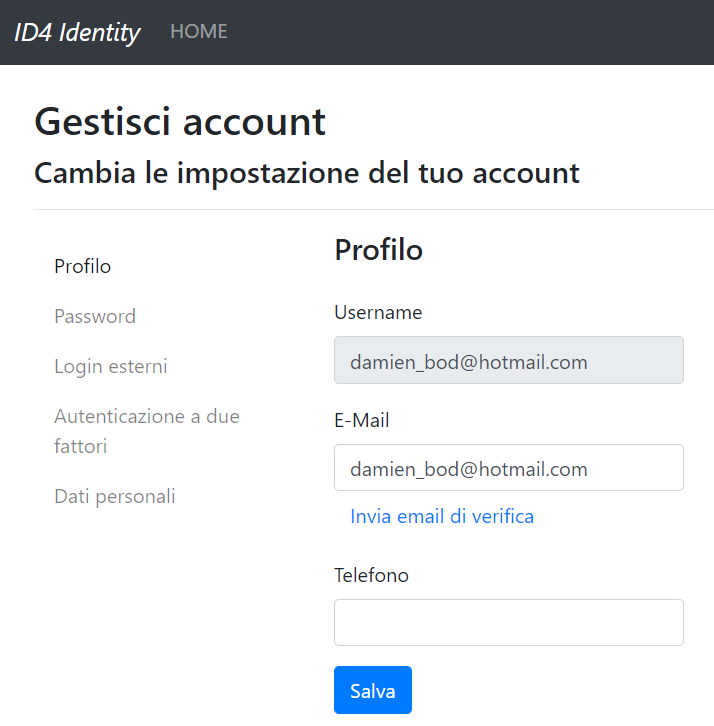
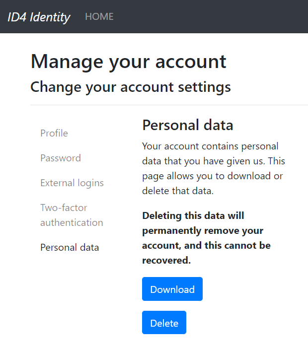

# An ASP.NET Core IdentityServer4 Identity Template with Bootstrap 4 and Localization

[NuGet](https://www.nuget.org/packages/IdentityServer4AspNetCoreIdentityTemplate/) | [Changelog](https://github.com/damienbod/IdentityServer4AspNetCoreIdentityTemplate/blob/master/Changelog.md) 

## Features

- ASP.NET Core 2.1
- Latest ASP.NET Core Identity
- Bootstrap 4 UI
- Localization en-US, de-CH, it-IT
- TOTP
- Personal data, download, delete (part of Identity)
- Azure AD, Cert, key vault deployments API
- SendGrid Email API
- npm with bundleconfig used for frontend packages
- EF Core 
- Suppport for ui_locales using OIDC logins

some print screens:

it-IT



de-DE


en-US



## Using the template

### install

From NuGet:

```
dotnet new -i IdentityServer4AspNetCoreIdentityTemplate
```

Locally built nupkg:


```
dotnet new -i IdentityServer4AspNetCoreIdentityTemplate.1.0.3.nupkg
```

### run 

```
dotnet new sts
```

### Setup, Using the application for your System

- Change the EF Core code from SQLite to your required database
- Install the npm packages, either using the cmd with NodeJS, or Visual Studio 
- Change the ApplicationUser class as required, remove/add the properties
- Add the migrations and create the database
- Define the deployment URLs, create the certs, and use these in your applicaiton (Startup, config files)
- Add the external providers for login as required, or remove
- Remove the UI views which are not required
- Add remove the resource file localizations and also in the Startup.
- Add the client configuration to the Config.cs class (dev, test, staging, prod, or whatever)
- Update the claims in the IdentityWithAdditionalClaimsProfileService
- Add the security headers as required, CSP, IFrame, XSS, HSTS, ...
- If you deploy in a multi instance environment, add the sesssion data to a database using the IdentityServer4.EntityFramework NuGet package

### uninstall

```
dotnet new -u IdentityServer4AspNetCoreIdentityTemplate.1.0.3.nupkg
```

## Development

### build

https://docs.microsoft.com/en-us/dotnet/core/tutorials/create-custom-template

```
nuget pack content/IdentityServer4AspNetCoreIdentityTemplate.nuspec
```

### dotnet Migrations

#### open the cmd in project folder:

```
dotnet restore

dotnet ef migrations add sts_init --context ApplicationDbContext --verbose

dotnet ef database update  --verbose
```

## Links

http://docs.identityserver.io/en/release/

https://github.com/IdentityServer/IdentityServer4

https://getbootstrap.com/

https://nodejs.org/en/

https://www.npmjs.com/
